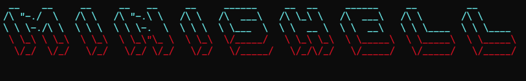

# 🐚 Minishell

<p align="center">
  
</p>

## 📌 Project Overview

**Minishell** is a simplified Unix shell implemented in C. It mimics the behavior of the Bash shell by interpreting and executing user commands. This project is a core part of the 42 School curriculum and aims to deepen understanding of process control, signal handling, parsing, and system calls in Unix-like operating systems.

The shell supports:
- Built-in commands: `cd`, `echo`, `env`, `exit`, `export`, `pwd`, and `unset`
- Input/output redirection (`>`, `>>`, `<`)
- Pipes (`|`) and multiple command execution
- Environment variable expansion
- Signal handling for `Ctrl+C` and `Ctrl+\`
- Execution of external programs using `$PATH`

## 🚀 How to Compile

Clone the repository and compile the project using the provided Makefile:

```bash
make
```
▶️ How to Run

```bash
./minishell
```
